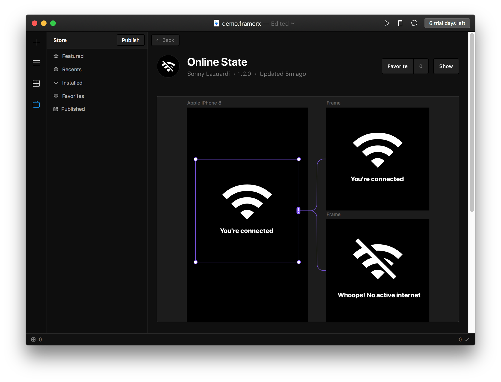

## Online / Offline State

Framer X Component to display online state

Connect to the first frame to be online state, and the second frame to be offline state

https://store.framer.com/package/sonnylzgrb/online-state
